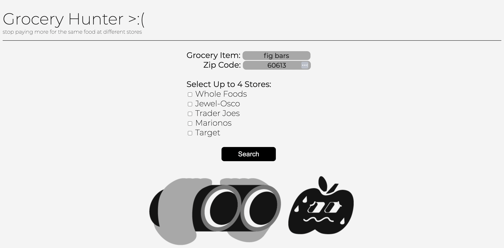
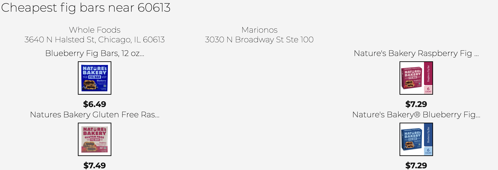

# Grocery Stores Api

Backend for a simple flask website that finds the cheapest items out of a bunch of grocery stores carrying the same item. I noticed sometimes the cheapest grocery store would not always carry the cheapest item which inspired me to create this.

Currently I have fully functioning customer scraping apis for:

- Whole Foods
- Jewel Osco
- Trader Joes
- Marionos
- Target

This is scewed towards Northside Chicago grocery stores but I am planning on expanding this more in the future.

## Screenshots





## Deployment

To deploy this project run

```bash
  git clone https://github.com/benbav/grocery-stores-api
```

```bash
  cd path/to/grocery-stores-api
```

```bash
  pip install -r requirements.txt
```

```bash
  flask run
```
